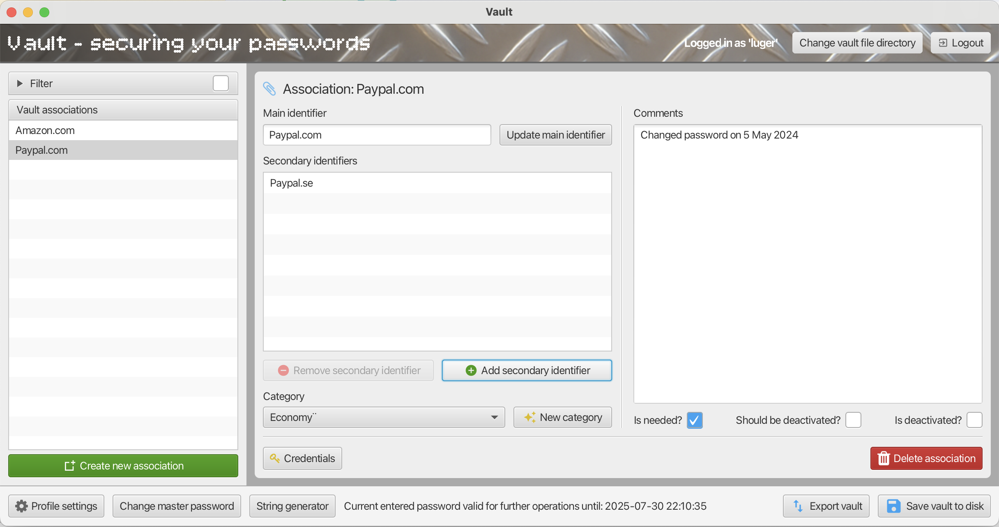
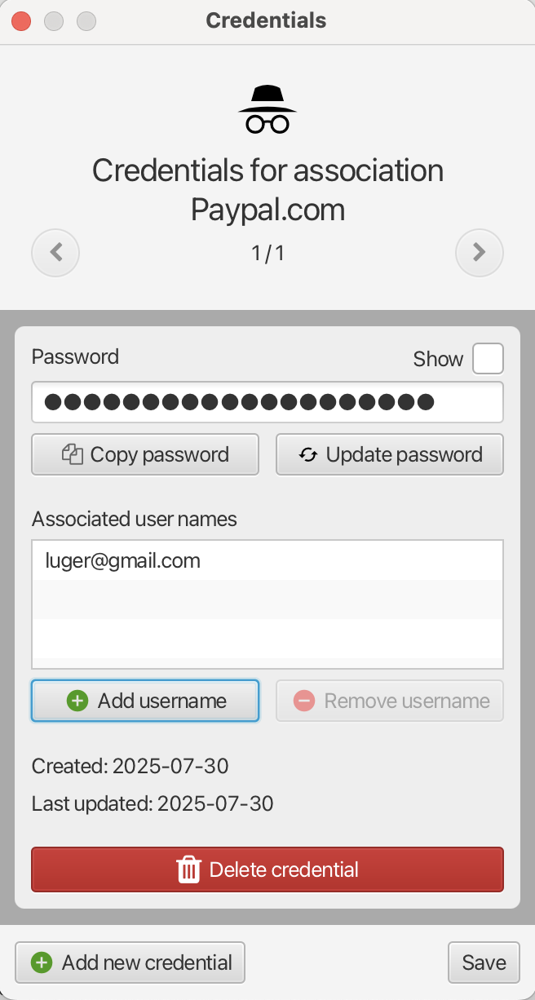

# Vault - registration, subscription and password organiser

Rewritten with only JavaFX instead of the initial project (https://github.com/fast-reflexes/Vault) which used TornadoFX 
which is now deprecated. Most core functionality has almost not been touched (e.g. crypto classes).

Current versions used are JavaFX 24.0.2 and Java 23 with Gradle 8.14.3 and Kotlin plugin 2.2.0.

#### Main view

  

#### Credentials view

  

## Documentation:

Vault is an offline desktop application used to manage memberships of different kind, be it subscriptions, usernames, 
codes and passwords or any other similar use cases. To do this, it uses the concept of **associations** and 
**credentials**. 

### Associations

An association is a main identifier (e.g. name or reference) associated with an amount of secret and non-secret data.
An association has a main identifier and an arbitrary number of secondary identifiers. The main identifier is the principal
name of the association and can be the name of a website or a service or anything else. The secondary identifiers are 
alternative names that an association may be found under, for example the same password is used for both `Amazon.com` and 
`Prime Video`, then`Amazon.com` might be the main identifier and `Prime video` may be a secondary identifier 
(or vice versa). The main identifier must be unique whereas alternative identifiers may overlap.

An association also may belong to a category and have a comment attached to it. Three flags indicate whether the
association is currently needed, whether it should be deactivated or whether it already has been deactivated (unused
accounts might need to be closed but it might be a long procedure with the service in question).

The very core of the association is its credentials.

### Credentials

An association may have one or many credentials attached to it. A credential is a password with one or several usernames
connected to it. When logging in to Vault, the credential data is never stored in memory in unencrypted form
except for when a particular credential is being edited.

* Använder Base64 för allt som har med krypto att göra, använder UTF8 för att läsa och skriva till fil (eftersom jag
  har radbrytningar där så Base64 räcker ej) samt UTF8 i den okrypterade versionen av valvet (när den krypteras blir den
  till Base64).
* Tänkte använda GCM för att kryptera men insåg att detta ej var bra då GCM är mer känsligt än CBC. Med GCM hade jag
  behövt hålla reda på vilken IV som användes varje gång och det ger ett probem, nämligen att en attackerare kan spara en
  gammal fil (med en tidigare IV) och låta en användare använda den igen (varvid 2 olika krypteringar med samma IV / Nonce
  kan erhållas vilket breakar hela confifentialityn. Dessutom skulle jag även MED GCM beöva köra en HMAC på hela den
  sparade fieln för at se att inte anat har förändrats.. Dena mac innehåller även ciphertexten vilket ger en
  Encrypt-then-MAC-skydd till CBCn... Detta är tillräckligt varför den extra autenticering som GCM bringar till tablen
  är onödig. Man hade kunnat använda en randomiserad IV för GCM (är ok med 128 bitar) men återigen finns det ingen vinst
  med det.. GCM är fett men i detta fall är CBC bättre).

### Setup

Vault uses two different locations; the location of the system settings and the location of profiles. The latter is set
manually when you start Vault for the first time. The former is set to the current directory if the env var
`IS_DEVELOPMENT` is set to `true`, otherwise it uses os information to determine what path to use.

### Usage

When you start Vault for the first time, you must select where to store your profiles. Once this choice has been made,
you may create a profile and log into Vault with that profile. The selection that you made about where to store profiles
is stored in a file called `vault.settings` which is stored in the same directory that you run Vault from. If you 
encounter problems with Vault regarding where profiles are stored, you may delete this file which will cause a prompt
about this setting the next time you start vault. The profiles themselves will not be deleted in this process but if you 
change the directory where they are stored, you might need to move them from where they initially were. You may also 
change this directory when logged in (might also require you to manually move the profile if you change directory).

After registering with a password, you may log in to Vault with the same password. This password is used to encrypt all 
the other data that you store in Vault. Therefore, the data may only be decrypted by you. When logged in, you may add 
and remove associations and credentials as you wish. When doing some operations you may have to enter your vault password
anew. This includes operations which are extra sensitive (exporting your vault or persisting it to disk) or that require
access to encrypted data (see `Encrypted data changes in memory` further down). For the former case, you must always
enter the password but for the latter, there is a parameter that controls for how much time an entered vault password may
be saved in memory. During this time and for these types of operations, Vault will not ask you to reenter the password
but will instead reuse the password stored in memory. Each time you do such an operation, the timeout when Vault
forgets your password will be extended. Once the timeout expires, Vault will remove your entered password from memory
and you must enter it anew the next time you wish to perform an operation where the password is needed. You may 
configure this timeout in the `Profile settings` where you may also manage categories and your default password length.

When adding a new credential, Vault offers you the opportunity to create the new password for you. Your default password
length (configurable in `Profile settings`) is used as initial value for this setting but it may be adjusted in the dialog.
You may also use the `String generator` to generate arbitrary random strings for external use.

The vault can be exported to a cleartext text file in case you want to store your password in some safe location
other than Vault. As said, this operation always requires your password and storing passwords in cleartext obviously
implies a certain risk which you must be aware of.

## Run

To run during development, execute `./gradlew run`

To build a thin jar, execute `./gradlew jar`

To build a fat jar, execute `./gradlew fatJar`

To run fat jar, execute `java -jar <JAR>>`

An error is displayed on started due to that this project does not use Java modules and thus, this project is an unnamed
module. This can be ignored.

## Build

### Mac
Vault can currently be build for Mac and Windows. The built jar file needs to include JavaFX libraries and thus we build
a so-called **fat** jar (with all dependencies included as opposed to a thin jar which you have to link dependencies
to when running it). We then use `jpackage` (a tool included in all Java JDK's after 14) to create an installer.

Since JavaFX uses low-level OS graphics utilities, we must bundle the specific Windows version of JavaFX when we build
for Windows. We must thus create fat jars separately for Mac and for Windows using the UN-suffixed version of the
dependency for Mac (even though one with the `:mac` suffix exists but it doesn't work) and the one suffixed with `:win`
for Windows.

Export the fat jar using `./gradlew fatJar`.

Once the jar is exported, it can be tested in the correct environment using `java -jar <NAME OF JAR>`. Thus should work
as expected in the environment that we wish to build for.

Once we have the jar, package it into an installer with a Java runtime INCLUDED in the bundle using `jpackage`. 
Building the jar can be done on any computer as long as the correct dependency for the target platform is included.
Building the installer needs to be done on the actual platform that we're building for.

Thus, to build on a Mac computer with Java 23 (or later) installed, execute (adjust paths if necessary):

    jpackage --input build/ --name Vault --main-jar libs/vault-javafx-1.0-fat.jar --main-class com.lousseief.vault.MainKt --type dmg

This will include the input directory `./build/` in the build and then, relative the root of the input directory, it will
look for `libs/<JAR>` for the job to create an installer. This command results in a `dmg` image which can be used like
any other `dmg` image on Mac; mount it, drag the program to the applications folder, unmount it and now you can start 
Vault using any means. To customize the icon, special use of `jpackage` is needed.

#### Step list
1. Verify that the unsuffixed dependency of JavaFX is commented out in the Gradle build file.
2. Make sure that build file is synced so that the correct dependencies are downloaded.
3. Build the fat jar using `./gradlew fatJar`
4. Test the jar if you want to using `java -jar <JAR>`
5. In the root folder of this project, run: `jpackage --input build/ --name Vault --main-jar libs/vault-javafx-1.0-fat.jar --main-class com.lousseief.vault.MainKt --type dmg`
6. Copy the `Vault.dmg` file onto the desktop
7. Double-click it and drag the program icon to the left to the applications folder to ther right, confirm overwrite if
a previous version of Vault was already installed.
8. Eject the mounted `.dmg` image.
9. Delete the `.dmg` file.
10. Done

### Windows

For Windows, it is slightly more complicated. First of all we must make sure to build a jar with the Windows-specific
version of JavaFX. After that, some extra care must be given to Vault for it to appear as we want on Windows. For example
some widths may differ or transitions between scenes may be ugly. Test it with `java -jar <JAR>` until you're happy.
At this point the `jpackage` command may fail:

    jpackage --input ./ --name Vault --main-jar vault-javafx-1.0-fat.jar --main-class com.lousseief.vault.MainKt --type exe

On Windows we need to install some kind of utility called Wix. Some people say we might have to have .Net platform installed
too but this was not necessary in my case. Wix Toolset (v. 3.14 was used at the time of this writing), however, it is a 
bit buggy and has problems with odd paths and filenames. Therefore, create a NEW directory and put ONLY the jar in this 
directory. Then enter that directory and execute the above command. Then we will have simple path and file names and 
the almost empty input folder will not cause any problems (it seems Wix will process ALL the content of the input folder 
even if it's not related to the build and therefore ANY file with an odd filename will cause a problem). Note also that 
`jpackage` is not automatically added to the `PATH` env var so this has to be done manually.

No matter if we create an `exe` or an `msi`, the installation will hopefully proceed without problems but it will end
silently so it's easy to believe the program has not been installed. Make sure the installer has finished (by attempting
to delete it and see if this can be done without error messages) and then check the program directory to verify that
a new folder for `Vault` has been created. Create a shortcut to the app and place on the desktop and you're good to go.

Some particular adaptations to Windows had to be done; some cosmetic ones but also for example where the settings file 
should be stored.

#### Step list
1. Verify that the JavaFX dependency suffixed with `:win` of JavaFX is commented out in the Gradle build file.
2. Make sure that build file is synced so that the correct dependencies are downloaded.
3. Build the fat jar using `./gradlew fatJar`
4. Copy the jar to a Windows computer with Java JDK 23 or higher installed.
5. Test the jar if you want to using `java -jar <JAR>`
6. Move the jar to a separate folder on the Windows computer, for example `build` on the desktop.
6. Move into the folder mentioned in previous step and run: `jpackage --input ./ --name Vault --main-jar vault-javafx-1.0-fat.jar --main-class com.lousseief.vault.MainKt --type exe`
7. Uninstall previous version of Vault via `Add or remove programs`.
8. Double-click the created `Vault.exe` file and let the program install.
9. Delete the `Vault.exe` installer, if it complains about being used, kill the program `Installer of Vault`.
10. Done

## Technical documentation

### Domain classes

Domain classes that are not prefixed with `Ui` are the "regular" domain classes that are general Kotlin / Java objects
and which map 1:1 to the actual data that is persisted. Corresponding classes prefixed with `Ui` are ui versions of the
same classes where most properties are replaced with JavaFX property observables and sometimes data is duplicated in
multiple forms for convenience.

### Format and function

A `.vault` file contains 6 rows of data: `keyMaterialSalt`, `verificationSalt`, `verificationHash`, `iv`, 
`encryptedData` and `checkSum`.

#### Step 1: deriving the password and verifying it

When we login, the password is used as input to a `PBKDF2` password derivation or password hash function. This function 
uses `HMAC` with `SHA512` to derive a password (or a hash if it's not used as a password). The output is variable but
should not exceed the output size of the used hash so since we use `SHA512`, we take 512 bits of outputs from this
`PBKDF2` function. The difference between a hash and a password derivation function is that the latter uses a salt
as partial input (to remedy the use of rainbow tables) and also runs the HMAC a large number of times for it to take
a lot longer than a regular hash.

The 512-bit output from this step is then run AGAIN through the `PBKDF` function with a new salt (`verificationSalt`). 
This time, we save the result (`verificationHash`) as a hash of the generated key from the previous step. This way, 
we can easily verify whether an entered password is correct or not.

The final part in this step is to divide the key generated in the first iteration into two parts consisting of 256
bits each. The first part is used as encryption key and the second part is used as a hmac key.

#### Step 2: verifying the vault file and decrypt data

In this step we use the hmac key (256 bits) from the previous step and we run the entire vault file and the hmac key
through `HMAC` with `SHA256`. The output is the `checkSum` above and when we access the vault, we verify that the 
calculated checksum is the same as the stored one.

The encryption key derived in step 1 is then used along with an initialization vector (`iv` above) to decrypt the
vault's encrypted data containing the actual data of the vault. The encryption algorithm used here is `AES256` in
`CBC` mode.

#### Summary
Vault reads from an encrypted file and uses the user's password to derive an encryption key used to decrypt and encrypt
the data in this file. When the vault is open and the program is used to manipulate data, the actual credentials are not
in memory, instead, they are kept in the encrypted string in memory. When credentials are accessed, one must enter the
password if a certain configurable time has passed. When the credentials view is exited, the credentials are
directly saved to the encrypted data in memory. To save it to disk, one must also save the entire vault (button to the
lower right). Other data updated in the vault will also only be saved upon saving the entire vault.

### Data states during usage

There are three levels of persistence in Vault:

* Data structure changes in memory
* Encrypted data changes in memory (secret data is not available in data structures in memory during usage)
* Vault file changes

Different usage patterns trigger different of these changes and ultimately, one must save the vault to disk to persist
it across sessions.

#### Data structure changes in memory
 
Changes to data structures in memory are triggered by:

* Updating profile settings (add or remove categories, changing default password length, changing vault opening time)
* Updating existing associations (main identifier and credentials not included)

#### Encrypted data changes in memory

Changes to encrypted data in memory are triggered by:

* Changing vault master password
* Adding, removing or updating credentials
* Adding or removing associations or updating the main identifier of an association

#### Vault file changes

Vault file changes are only triggered by one action:

* Clicking `Save to vault to disk` buttons

#### Summary

The encrypted data in memory exits because we don't want to store the data in plaintext in memory. However, we don't 
want to reencrypt that data all the time when small changes are made to associations. Therefore we only do this for
select cases. The association data in memory is both a map from string (main identifier) to association as well as
an ordered list of associations (ordered by main identifier). The ordered list must be manually updated whenever
we need to add or remove associations from the map (e.g. this does not trigger an update of the ordered list) but
the map and the list contain the same association objects.

When associations are added or removed or when a main identifier is updated, the map in memory is updated. The encrypted 
data is updated as well on these occasions. When we manipulate credentials, we manipulate the encrypted data stored in 
memory as well. So if a vault has been updated in some ways, the current encrypted data thus reflects everything from 
none to all of these changes, typically only a few of them.

To be able to determine if a user has saved the current state of the vault or not, we also need a way of comparing the
current state with the state of the persisted data. This is done by, upon login and when we persist to disk, saving 
data from the persisted file. We can then easily at any time compare the current state and say if it's the same as
the persisted one or not. To avoid randomness altering data which is not in essence different, we use the same IV
(initialization vector) when updating the encrypted data in session but when we persist it to disk, we make sure to
use a new IV.

All in all, the cleartext data structures in memory reflect the current state of the vault. Some data are not in these
structures and they reside in the encrypted data stored in memory. The encrypted data can be decrypted and read from
when needed. The encrypted data is also updated in-session in select cases. Upon login and persisting data to file,
the structures from the file are stored in such a way so that we may compare the current state of the vault to the 
persisted state at any time to determine whether the user needs to save or not. The encrypted data in memory is thus
a partially updated vault with a state between the in-memory cleartext data structures ans the persisted state on file.
The file holds the stored state of the vault.

## Knowledge
		
### JavaFX

* Set bindings and event listeners in `Platform.runLater {}` in `initialize` instead of directly in `initialize`. In
some cases, timing issues related to FXML bindings between controller and FXML may cause bindings and event listeners
not to work as they should. This seems to happen more often when attaching sub views and similar as opposed to when ¨
setting a view directly on the root element of a window.

### Icons

This project uses icons from a series of different libraries:
* Fontawesome (https://fontawesome.com/v3/icons/, https://fontawesome.com/v4/icons/)
* Material Icons
* Material Design Font (https://pictogrammers.com/library/mdi/)

Even more icons are available. To see icons online, check the build file and extract the version of the icon library used 
and search for that, for example Font Awesome 4.7.0

### JavaFX CSS

* You can't target elements
* Classes are added with `styleClass` attribute in FXML and may be found in the global css file or a local one
* Some attributes are not the same as the ones used in HTML, for example, the button color is set with `-fx-color` 
instead and one should NOT use `-fx-background-color` because then focus behaviours are messed up as well.

### Buttons

Buttons may be **default** or **cancel** buttons (or none). A default button is blueish and is clicked when hitting enter
and a cancel button has no special appearance but is clicked when hitting the escape button. This applies if no other
button tries to do the same in the same scene. Note that a third button can be the focused button, e.g. that is not the
same as being a default button. Normally, button types which are `OK` or `OK_DONE` are default buttons and `CANCEL` or
`CANCEL_CLOSE` are cancel buttons. This can also be set manually in the code.

### Observable properties

Remember that observables support LAZY evaluation and if so, they will not trigger reevaluation as expected. For example,
if an observable is added as a dependency to a binding, the evaluation of the binding will NOT necessarily be retriggered
just because the observable changes value. The only way an observable becomes eaglery evaluated is by adding a change 
listener.

### Transitions between scenes

When changing between scenes, there may sometimes be a flickering before the window is resized to its correct size
(using `.centerOnScreen()` and `.resizeToScene()`). This is noticeable especially on Windows where it's really ugly.
To solve this, the new strategy is to hide all scenes before they are rendered (using `.hide()`) and then do the layout
and set min and max heights and so on, then run the auto sizing and THEN show the window. This works fine and solves all
the problems (makes it look nice even on Windows), but there are a few small caveats:

* When we run `.show()` or `.showAndWait()` on a Window that has been hidden, it will automatically center and size 
itself to the scene. If we DON'T want this, we must take special action and avoid this procedure (this has been done
when altering between register and login views since if we have repositioned the window then, it should not be 
centered again).

* Auto-centering and sizing WILL be deferred to the moment we show the window so some adjustments to different
width and heigh properties after such a call (`.resizeToScene()`) but before showing the window might have strange
effects. For example, at one time setting min width and height AFTER such a call would use the values of the OLD scene
and then the minimums did NOT reflect the new scene's size as intended. The best way to avoid resizeable screens is thus
not to set min and max heights but instead set `resizeable = false` on the window.

### Miscellanous

* SceneBuilder is a GUI with which you can build JavaFX applications using drag and drop.
* Don't nest dialogs, it's SUPPOSED to work but it's better to chain dialogs instead, closing the first before opening 
the second and I HAVE experienced that the application hangs without any error message. when nesting dialogs.
* When double-clicking the window on Mac, a certain zoom-operation takes place which is different from just resizing
the window an equal amount. This zoom does not always reset to initial level when done again with JavaFX. This is a known
unsolved bug and it gets especially ugly when doing it when you're logged in and then logging out, then the login screen
appears at the bottom instead of in the middle (since the screen is full but the login window only occupies a small 
part of it).
* Mac and Windows uses opposite button order; on Mac, dialogs have the OK button furthest to the right and Cancel
buttons to the left of it whereas on Windows, the Ok button is always furtherst to the left and the other buttons
are to the right of it.

### Questions

None currently
  
### Questions and answers

#### Hur funkar konversion till 7-bit ASCII tex? Vad görs med den sista biten?
ALLA bytearrayer som omvandlas till en sträng genom new String(bytes, Charset) har automatiskt en replacement character 
för bytes som inte finns i deras representation. Vill man ha mer kontroll över detta så får man använda en 
CharacterEncoder. Detta innebär att i krypteringsavseende är det bra om man ser till att det Charset man använder kan 
hantera allt tänkbart bytesinput som man skickar in, eftersom annars begränsas säkerheten genom att OLIKA bytes mappas 
till SAMMA karaktär vilket är ofördelaktigt. Kom också ihåg att även tecken som inte SYNS faktiskt ÄR tecken och lagras 
som sådana i en sträng. Ska strängen användas för I7O av en människa finns det dock såklart en begränsning här.

## TODO

### Backlog:

***NOTHING atm***

### Inbox (to do MAYBE at some later point)
* When you add the password, also add it with asterisks except if a checkbox is filled indicating clear text (like when passwords are shown)
* Add feature to see stats (or use a different word), for example list usernames and how often they are used
* Implement coloring of entries that are changed and unsaved in the entries list and also color fields that are changed.
* Remove default Java menu (and content) from the application
* Use Java modules and add module-info.java to perhaps get rid of error when starting with jar
* Fixa ny ikon till jaren
* Switch to red buttons in some dialogs where you confirm delete are confirmed
* Add logging via some central utility and frequently used logger library (dependency) and remove println's
* Perhaps use last updated flag in the association as well (not only in credential?)
* How is translations to ASCII done if wrong bytes are used? Is it sure? (not sure what this question is about?)
* Unify the terminology for the parameter used to keep the vault open, perhaps the term vaultOpeningTimeMinutes can be
used?
* Out everything in Platform.runLater instead of initialize that concerns bindings and listeners (especially if we see odd
timing issues, however, we must only add layout-related code in runLater, not heavy other stuff)
* Fix nicer icon for the Mac installer / program
* Make sure that references to the old scene is lost when we log out. How do we do that? Otherwise:
  * Delicate data can be left in memory
  * Odd things might happen when we log in again as another user (not likely and not yet seen but MIGHT happen I assume 
    if the data is still in memory or something).
* Add support for Linux
* Fix issue described previously about double-clicking the window in Mac (zoom function) which is a bug in JavaFX.
* Investigate and fix the issue with the Windows installer hanging despite Vault being properly installed.
